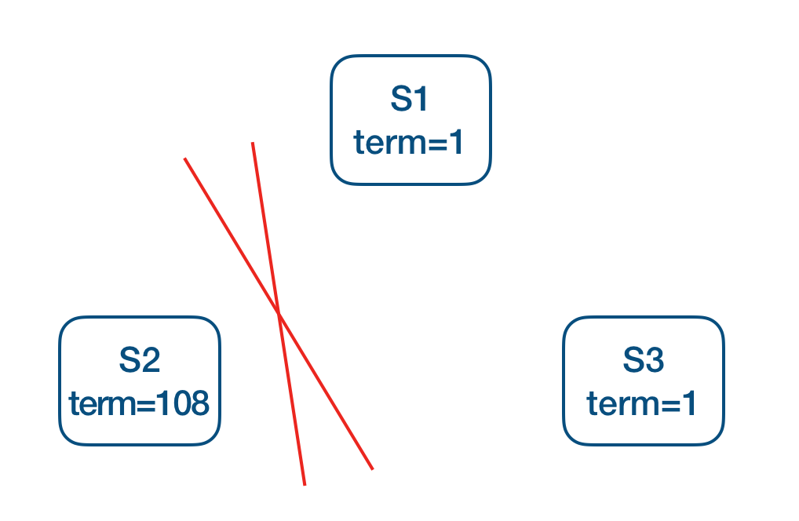
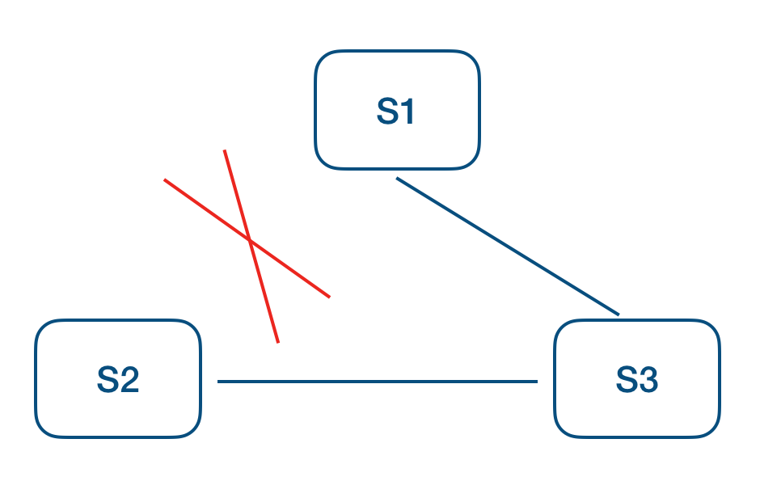

## 疑问
1. 所有的节点启动时都是follower,  如果指定时间段(election timeout)内无法收到任何消息，自己就会变成candidate, 然后发起投票请求
  * 任何消息包含了来自leader的日志复制, 心跳请求，又或者是哪个candidate发送过来了的投票请求？比如如果当前follower收到了其他节点的投票请求, 也会阻止自己的选举超时发生, 自己不会再去启动选举？
    	* 这个问题有点复杂, 正常来自于leader的日志负责，心跳是ok的，会更新lastLeaderTimestamp, 执行stepDown的时候也会更新lastLeaderTimestamp，比如节点在处理preVote和vote的时候，如果发现对方的term比自己高, 就会执行stepDown，从而更新lastLeaderTimestamp，进而可以阻止当前节点的选举超时，还有其他更复杂的场景也会更新lastLeaderTimestamp
2. 当一个新的节点当选为leader之后, 有哪些规则可以阻碍其他节点继续进行leader选举？
	* 如果当前新的leader之前在选举的时候， term比其他节点都大, 那么其他节点会进行stepDown, 重置leader超时检测
	* 如果term一样的话, 其他节点并不会执行相关action, 还是按照原先的节奏该选举选举, 所以当一个节点成功leader之后, 会立刻向其他节点发送心跳来告知自己leader的身份
		* 当其他节点接收到来自leader的心态之后，如果leader的term比自己大，又或者和自己相等, 但是自己正处于candidate或者leaderId位空的情况, 那么此时自己都会去进行stepDown(自己变成follower, 停止选举)
	* 除此之外, leader超时检测和选举超时检测的超时时间都存在random逻辑，这个进一步减少了leader选举冲突的问题
3. candidate怎么获取当前集群中所有的节点信息用于发起投票请求？ 集群创建的时候配置好的？
	* 是的, 初始化集群的集群列表信息是预算配置好的，后续可以通过membership功能进行副本管理
4. term的初始值是0 还是 1?
	* 是0
5. 在preVote机制存在的前提下(对称网络分区异常处置办法, 预防处于网络分区之外的节点不断增加自己的term, 网络恢复之后打断当前leader的lease)，一个新选举成功的leader, 他的term一定是集群中最新的？
	* 是的，根据半数以上的原理, 之前term下的leader，对应的term必然覆盖到了一半以上的节点(投票过程中就会更新term), 而新的节点如果要选举成功, 对应的term一定要大于或者等于集群一半以上的节点, 那么必然涵盖了之前term的某个节点, 也就是说当前新的leader的term一定是大于或者等于上一届leader对应的term
6. 当一个节点被选举成为leader之后，开始进行日志复制, 在日志复制完成之前, 可以处理读请求吗, 如何保证读取的一致性?（比如pre term recovery的场景下, s5,term=5的时候, term=3的log未复制完成前, 怎么处理log可能对应的读请求？）
	* 不行, 必须等到当前term下至少一条log完成同步才可以接受读请求
7. 一个新当选的leader，如果期间没有客户端写入操作, 是怎么把未应用到状态机的log应用到状态机的？
	* 再sofa-jraft中, 当一个节点成为leader之后, 会立刻在集群间写入一条在当前最新term下的log(配置类型的log)，等当前log完成commit之后, 当前leader会把截止到目前配置log还没有应用到状态机的log全部应用到状态机(配置log的写入之后触发应用状态机的一个入口, 如果有客户端写入也是可以的，必须要有新term下的log完成同步, 新leader才会知道lastCommitedIndex，才会触发应用状态机的操作)

## 选举过程
1. 当前follower在election timeout内未接收到任何请求
2. term+1, 然后身份转变成candidate发起投票请求,  candidate会一直维持当前状态, 直到以下三件事情之一发生
	* 自己成功当选
	* 别的candidate当选
	* 一段时间之后, 没有任何一个candidate当选 
3. 投票过程的一些规则
	* 每个节点对同样的term, 最多只会发起一次投票，先到先得，这样超过半数的投票机制可以保障最多只有一个candidate可以胜出，因为半数以上已经投票过的节点对相同term不会再次投票
	* 请求投票（RequestVote） RPC 实现了这样的限制：RPC 中包含了候选人的日志信息，然后投票人会拒绝掉那些日志没有自己新的投票请求。
		* Raft 通过比较两份日志中最后一条日志条目的索引值和任期号定义谁的日志比较新。如果两份日志最后的条目的任期号不同，那么任期号大的日志更加新。如果两份日志最后的条目任期号相同，那么日志比较长的那个就更加新。
		* 对称网络分区容忍性，Pre-Vote: 如下图 S1 为当前 leader, 网络分区造成 S2 不断增加本地 term, 为了避免网络恢复后S2发起选举导致正在良心工作的 leader step-down, 从而导致整个集群重新发起选举, 在 request-vote 之前会先进行 pre-vote(currentTerm + 1, lastLogIndex, lastLogTerm), 多数派成功后才会转换状态为 candidate 发起真正的 request-vote, 所以分区后的节点, pre-vote不会成功, 也就不会导致集群一段时间内无法正常提供服务
		
    	* 如上图 S1 为当前 leader, S2 不断超时触发选主, S3 提升 term 打断当前 lease, 从而拒绝 leader 的更新, 这个时候可以增加一个 trick 的检查, 每个 follower 维护一个时间戳记录收到 leader 上数据更新的时间(也包括心跳), 只有超过 election timeout 之后才允许接受 request-vote 请求
    		
	* 每个candidate在开始一轮选举的时候会重置一个随机的选举超时时间, 这样可以尽可能避免选举过于集中而导致的选票瓜分问题, 减小选举带来的耗时问题
4. 投票过程中可能发生的一些场景
	* 当前candidate当选,  身份转变成leader, 然后向其他节点发送心跳, 告知自己leader的身份, 阻止选举活动的继续进行 
	* 在等待投票的时候(可能还未发起投票, 或者发起了部分在等待结果), 收到了来自于其他节点的请求(宣告自己是leader)
		* 如果对方的term不少于自己, 则认可当前leader的地位, 自己的角色从candidate转变成follower
		* 如果对方的term比自己的小, 则拒绝此次的请求, 并保持candidate的状态
	* 多个follower都成为了candidate, 都发起了选举并瓜分了选票, 这时大家都不会胜出, 然后都会选举超时, 继续term+1, 重新发起选举