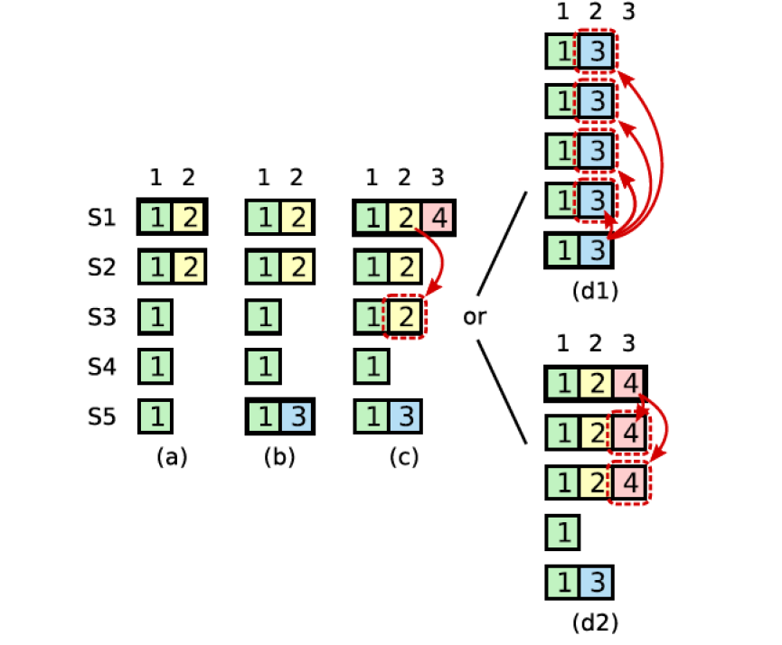
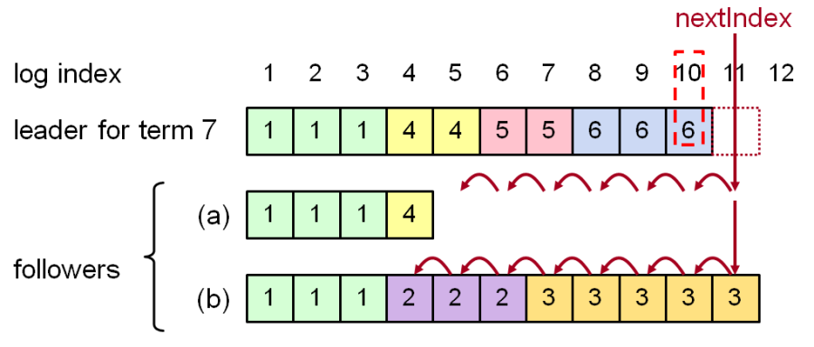

## Braft Log Recovery
Log Recovery这里分为current Term修复和prev Term修复，Log Recovery就是要保证一定已经Committed的数据不会丢失，未Committed的数据转变为Committed，但不会因为修复过程中断又重启而影响节点之间一致性。

current Term修复主要是解决某些Follower节点重启加入集群，或者是新增Follower节点加入集群，Leader需要向Follower节点传输漏掉的Log Entry，如果Follower需要的Log Entry已经在Leader上Log Compaction清除掉了，Leader需要将上一个Snapshot和其后的Log Entry传输给Follower节点。Leader-Alive模式下，只要Leader将某一条Log Entry复制到多数节点上，Log Entry就转变为Committed。 prev Term修复主要是在保证Leader切换前后数据的一致性。通过上面RAFT的选主可以看出，每次选举出来的Leader一定包含已经committed的数据（抽屉原理，选举出来的Leader是多数中数据最新的，一定包含已经在多数节点上commit的数据），新的Leader将会覆盖其他节点上不一致的数据。虽然新选举出来的Leader一定包括上一个Term的Leader已经Committed的Log Entry，但是可能也包含上一个Term的Leader未Committed的Log Entry。这部分Log Entry需要转变为Committed，相对比较麻烦，需要考虑Leader多次切换且未完成Log Recovery，需要保证最终提案是一致的，确定的。 RAFT中增加了一个约束：对于之前Term的未Committed数据，修复到多数节点，且在新的Term下至少有一条新的Log Entry被复制或修复到多数节点之后，才能认为之前未Committed的Log Entry转为Committed。下图就是一个prev Term Recovery的过程：

1. S1是Term2的Leader，将LogEntry部分复制到S1和S2的2号位置，然后Crash。
2. S5被S3、S4和S5选为Term3的Leader，并只写入一条LogEntry到本地，然后Crash。
3. S1被S1、S2和S3选为Term4的Leader，并将2号位置的数据修复到S3，达到多数；并在本地写入一条Log Entry，然后Crash。
4. 这个时候2号位置的Log Entry虽然已经被复制到多数节点上，但是并不是Committed。
	* S5被S3、S4和S5选为Term5的Leader，将本地2号位置Term3写入的数据复制到其他节点，覆盖S1、S2、S3上Term2写入的数据
		* 状态机只有明确告诉client成功的时候, 这次客户端请求才是成功的，否则结果未知(可能失败, 也可能是成功的，client侧需要做好幂等处理)，比如当前case, term=3的时候, 本地写一条log之后挂了，那么客户端肯定是异常的, 但是并不能说明当前写入就失败了, 因为term=5的时候, s5再次当选为leader，这是term=3写的log会被复制到其他节点, 当超过半数之后, 当前log就会被应用到状态机 
	* S1被S1、S2、S3选为Term5的Leader，将3号位置Term4写入的数据复制到S2、S3，使得2号位置Term2写入的数据变为Committed

通过上面的流程可以看出，在prev Term Recovery的情况下，只要Log Entry还未被Committed，即使被修复到多数节点上，依然可能不是Committed，必须依赖新的Term下再有新的Log Entry被复制或修复到多数节点上之后才能被认为是Committed。 选出Leader之后，Leader运行过程中会进行副本的修复，这个时候只要多数副本数据完整就可以正常工作。Leader为每个Follower维护一个nextId，标示下一个要发送的logIndex。Follower接收到AppendEntries之后会进行一些一致性检查，检查AppendEntries中指定的LastLogIndex是否一致，如果不一致就会向Leader返回失败。Leader接收到失败之后，会将nextId减1，重新进行发送，直到成功。这个回溯的过程实际上就是寻找Follower上最后一个CommittedId，然后Leader发送其后的LogEntry。因为Follower持久化CommittedId将会导致更新延迟增大，回溯的窗口也只是Leader切换导致的副本间不一致的LogEntry，这部分数据量一般都很小。

Follower a与Leader数据都是一致的，只是有数据缺失，可以优化为直接通知Leader从logIndex=5开始进行重传，这样只需一次回溯。Follower b与Leader有不一致性的数据，需要回溯7次才能找到需要进行重传的位置。
 
重新选取Leader之后，新的Leader没有之前内存中维护的nextId，以本地lastLogIndex+1作为每个节点的nextId。这样根据节点的AppendEntries应答可以调整nextId：

**nextIndex**

> local.nextIndex = max(min(local.nextIndex-1, resp.LastLogIndex+1), 1)