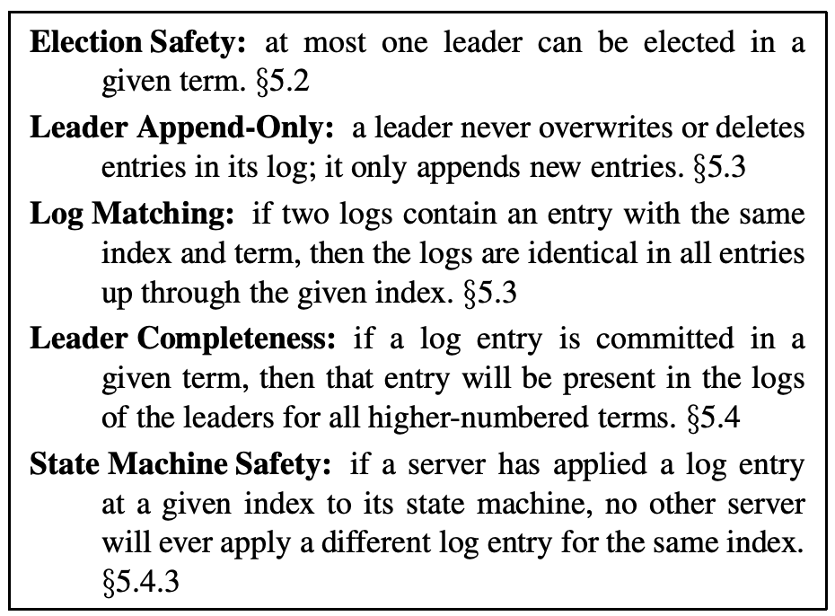

## 疑问
1. 领导人来决定什么时候把日志条目应用到状态机中是安全的；这种日志条目被称为已提交，在领导人将创建的日志条目复制到大多数的服务器上的时候，日志条目就会被提交
	*   已提交的日志条目有啥特殊标记吗？我(比如当前leader挂了，其它follow当选leader之后，怎么知道最新的已提交日志是哪个？)怎么知道当前索引的日志是已经提交的(复制到大多数的机器上了)
		* 没办法知道，新当选的leader会指定pendingIndex=lostlogindex+1，等>=pendingIndex的log完成半数节点以上的同步, 会更新last commit index(这时就存在已提交索引的信息了)，后续随着日志的不断同步, last commit index不断更新    
	* 如果当前Leader已经把来自客户端的日志条目复制到大多数的机器, 然后再准备应用到状态机的时候挂了, 这个会怎么样？这条日志条目还有效吗
		* 有效的，来自客户端的(最新的日志，不会出现pre term recovery的场景)已经同步到半数的机器的日志只要复制到半数以上节点，那么其实就已经是提交的了, 即使在ack客户端的时候crash了，也没关系, 新leader会把日志应用到状态机
2. 每个节点上的commitIndex为啥不持久化呢？

## 复制过程
1. 日志复制的一些规约
	* 领导人从来不会覆盖或者删除自己的日志，只会新增新的日志条目
	  
	* Log Matching Property
		* 如果在不同的日志中的两个条目拥有相同的索引和任期号，那么他们存储了相同的指令。 
		* 如果在不同的日志中的两个条目拥有相同的索引和任期号，那么他们之前的所有日志条目也全部相同。
			* 在发送附加日志 RPC 的时候，领导人会把新的日志条目前紧挨着的条目的索引位置和任期号包含在日志内。如果跟随者在它的日志中找不到包含相同索引位置和任期号的条目，那么他就会拒绝接收新的日志条目 
			* Raft 通过比较两份日志中最后一条日志条目的索引值和任期号定义谁的日志比较新。如果两份日志最后的条目的任期号不同，那么任期号大的日志更加新。如果两份日志最后的条目任期号相同，那么日志比较长的那个就更加新